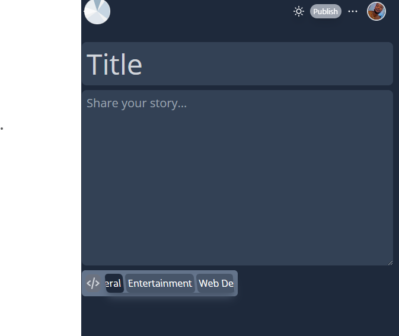
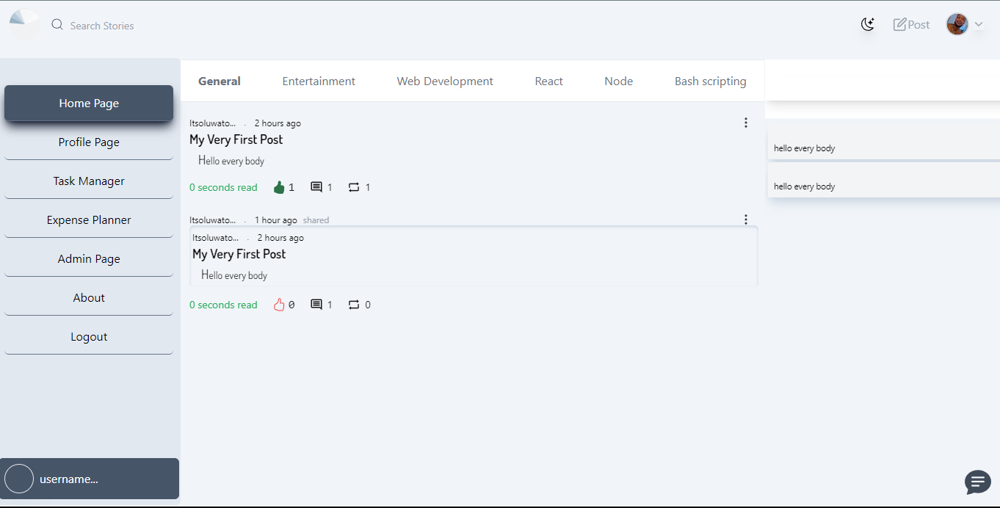
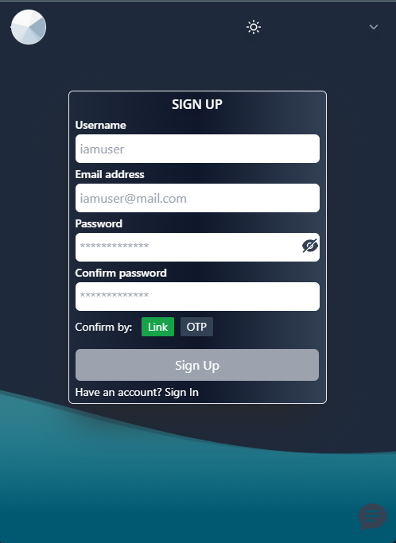
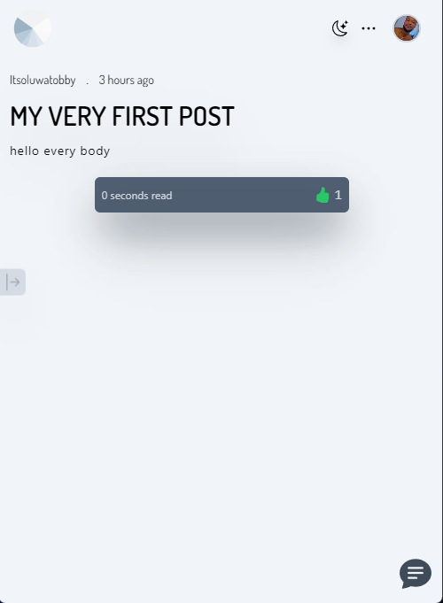
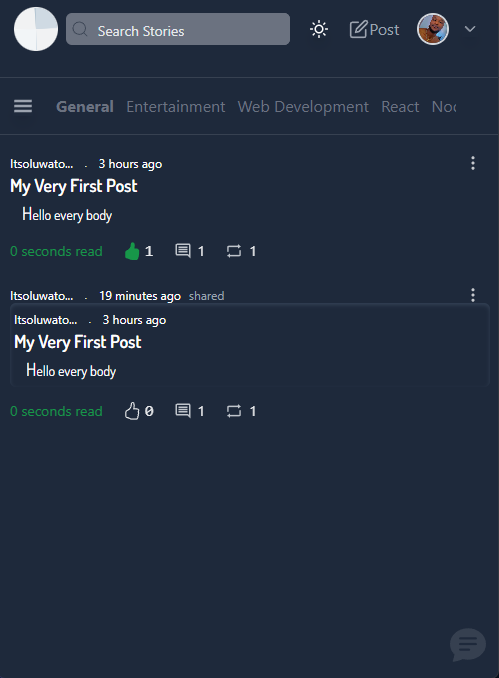
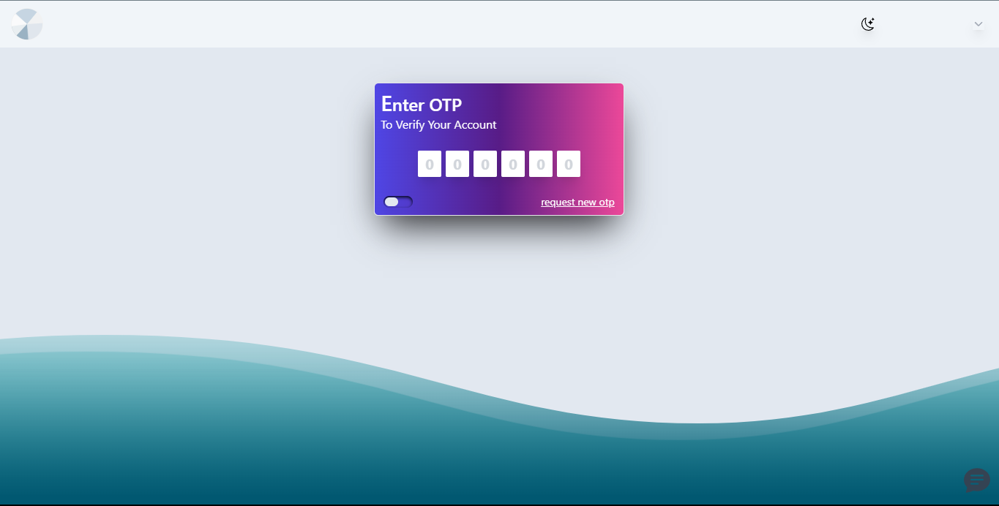
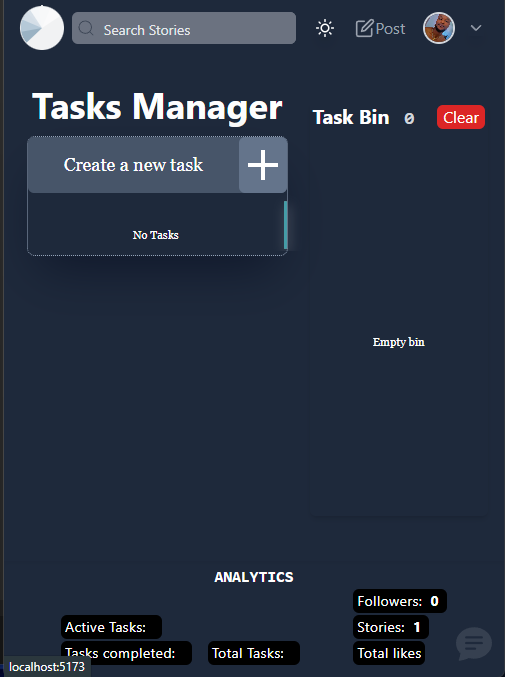
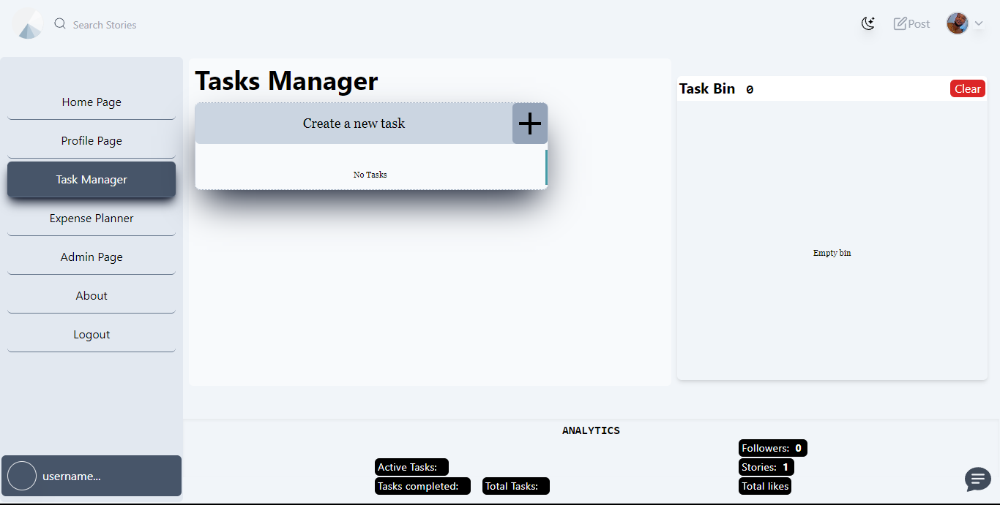

# REVOLVING

> Description **Let your world always be about you. A web app that's definetely about all you will ever wish for. You are your world and you define what you want in it**
Build with React Typescript using redux-toolkit 
---

> Tech stack
* ReactJS
* Typescript
* firebase (for image upload)
* socket.io/client
* redux-toolkit
* Tailwindcss
* React Monaco - Code Editor

#### _**FEATURES**_
---
* Registration and login page
* Password reset page
* Mini page with diffrent Utilites (i.e; Todolist, text editor, Chat section etc)
* Creating comments, view followers and subscriptions
* User Profile page
* Profile update page
* Chat section
* Code editor - [**react-monaco-editor**]
* Programming contents
* Responsive pages
* Feature to download any post in pdf format
----

---

---
