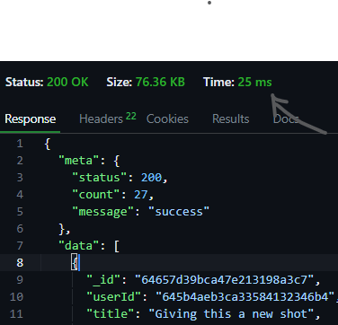

# REVOLVING API.
> Description **Let your world always be about you. A web app that's definetely about all you will ever wish for. You are your world and you define what you want in it**
---
> *Lang:* **Typescript**
```typescript
  interface User extends Request{}
```
---
> **Tech stack**
* Typescript
* Nodejs
* socket.io
* express.js
* redis
---
> **Server Traffic**

implemented **rate limiter** and **request slowdown using** express.js.

_Rate LImiter_ 
Each user can only send 30 consecutive requests at a time in 1 minute, then the server blocks any other requests comes from that same clent IP address with a **_429_ statuscode** _Too many requests_ for the remaining window time. 

_slowdown_

while slow down the increases the response time of each request by **500ms** after a user exceeds 1/2 of the above given request count.

---

> Also implement sessionId, roles verification, accessToken and resfreshToken

Accesstoken and user rols to confirm if a user a authorised to perform any task on a resource. 

RefressToken is used to issue a new accessToken if a user's accesstoken expires while still active. The refreshToken will be sent automatically immediately a user gets a **401 unauthorised response** and this automation will handle on the client.

---

> Data Caching

Redis is used for data caching which makes the api 10x faster in responding to user requests 

_BEFORE REDIS_


---

_AFTER REDIS_


---
> OTP and Link

Signing up an account and forgot password has two account confirmation options, either by a verification link or through a One Time Password (OTP), chosen option is being to sent to user email for proper verification. 

---

> **AUTHENTICATION**
---

Newly registered users are will be required to go through an email verification process. The email verification link/OTP can only be used once and only lasts for 15 minutes after which it expires.

_**incase of expired email verification link:**_ The user will be required to login with the registered credentials then a new email verification link will be sent to the user and this link will only last for 25 minutes before it expires.

Unverified users will not be granted access to perform CREATE, UPDATE or DELETE (_**CUD**_) operations until the account is verified but will have access to perform READ operation.

---
> **AUTHORIZATION**
---

Upon user login, every user is granted an access token which lasts for only 4 hours and a refresh token which lasts for a day. This token authorizes a user's access to the site's available resource. 

Upon registration, each user is given the role of a USER which is the default role assigned to all registered users. And after the access token expiration, a refresh token is used to get a new access token.

---
> Refresh token rotation
---
Also, the refresh token can only be used once then it becomes useless, a new refresh token is generated whenever it is used to get a new access token

**Granting of Roles**
---
Admin role has the ability of granting additional roles to specific users

---
