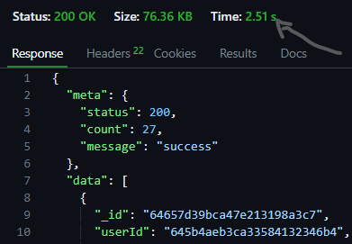

# REVOLVING API.
> Description **Let your world always be about you. A web app that's definetely about all you will ever wish for. You are your world and you define what you want in it**
---
> *Lang:* **Typescript**
```typescript
  interface User extends Request{}
```
---
> **Tech stack**
* Nodejs
* socket.io
* express.js
* redis
---
> **Server Traffic**

implemented **rate limiter** and **request slowdown using** express.js.

_Rate LImiter_ 
Each user can only send 30 consecutive requests at a time in 1 minute, then the server blocks any other requests comes from that same clent IP address with a **_429_ statuscode** _Too many requests_ for the remaining window time. 

_slowdown_

while slow down the increases the response time of each request by **500ms** after a user exceeds 1/2 of the above given request count.

---

> Also implement sessionId, roles verification, accessToken and resfreshToken

Accesstoken and user rols to confirm if a user a authorised to perform any task on a resource. 

RefressToken is used to issue a new accessToken if a user's accesstoken expires while still active. The refreshToken will be sent automatically immediately a user gets a **401 unauthorised response** and this automation will handle on the client.

---

> ~~SessionID~~ 

---

> Data Caching

Redis is used for data caching which makes the api 10x faster in responding to user requests 

_BEFORE REDIS_



---

_AFTER REDIS_


---
> OTP and Link

Signing up has two account confirmation options, either by link or OTP, choosen option is being to sent to user email for proper verification
